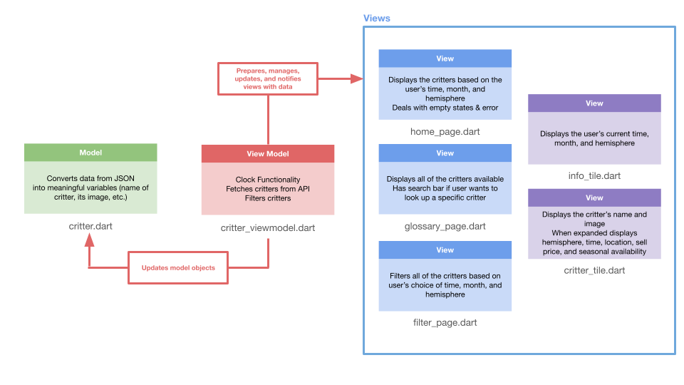

# Critter O’Clock
### **Team-H: Michelle Hong & Grace Hines**

## Animal Crossing: New Horizons
*Animal Crossing: New Horizons (ACNH)* is a 2020 social simulation game developed and published by Nintendo for the Nintendo Switch. It is the fifth main installment in the Animal Crossing series. In New Horizons, the player controls a character who moves to a deserted island after purchasing a getaway package from Tom Nook, accomplishes assigned tasks, and develops the island as they choose. They can gather and craft items, customize the island, and develop it into a community of anthropomorphic animals. (Wikipedia)

Read more [here](https://en.wikipedia.org/wiki/Animal_Crossing:_New_Horizons)

## About Critter O'Clock
Since ACHN is variable-dependent (meaning certain bugs and fish only appear during partciular hours, months, weather conditions, hemispheres, etc.) we created an app that allows the user to know which bugs and fish can be caught given their real, current time and month. If the user wants to view all of the bugs and fish available in the ACNH universe, they can navigate to the glossary page. If the user wants to view all of the bugs and fish available given partciular variables, the user can navigate to the filter page and choose their desired variables and filter the critters. On each page the critters have a dropdown view that gives details about its hemisphere, time, location, sell price, and seasonal availability.

### Screenshots of App

---

## API Used
To build our app we used the [Nookipedia API](https://api.nookipedia.com/) which pulls data from the Nookipedia wiki page. To gain access we submitted a request for a unique API key.

## MVVM diagram
A diagram of our MVVM setup is below

  

## Build Instruction
In order to run our app, clone this repository onto your local machine. Once cloned, navigate into the folder critter_app and run `flutter pub get` to retreive all dependencies. Open XCode/Simulator on your machine and run `flutter run` to run the iPhone 17 Pro simulator. The app should be launched immediately, and **please ensure that your machine as well as your simulator has the sound turned up!**

## Dependencies
The following dependencies were used for the creation of our app:
### Main Dependencies:
- flutter — Core Flutter SDK used to build the UI and run the application.
- http — Makes network requests (e.g., fetching data from APIs).
- provider — State management library used to handle app-wide data efficiently.
- shared_preferences — Stores small amounts of persistent data locally on the device (e.g., settings, simple user data).
- audioplayers — Plays audio files and sound effects in the app.
- intl — Provides internationalization and formatting utilities (dates, numbers, localization).
### Development & Testing Dependencies
- mockito — A popular mocking framework used for writing unit tests.
- build_runner — Used to generate necessary files for certain packages (e.g., code generation, mocks).

## Features 
- Animations: When the user clicks the drop down arrow on a Critter card, it seamlessly expands the box to show more information.
- Gestures: When the user is on the home page and drags down, a loading icon will appear at the top to signify a refresh, and if they release, it will refresh the data. 
